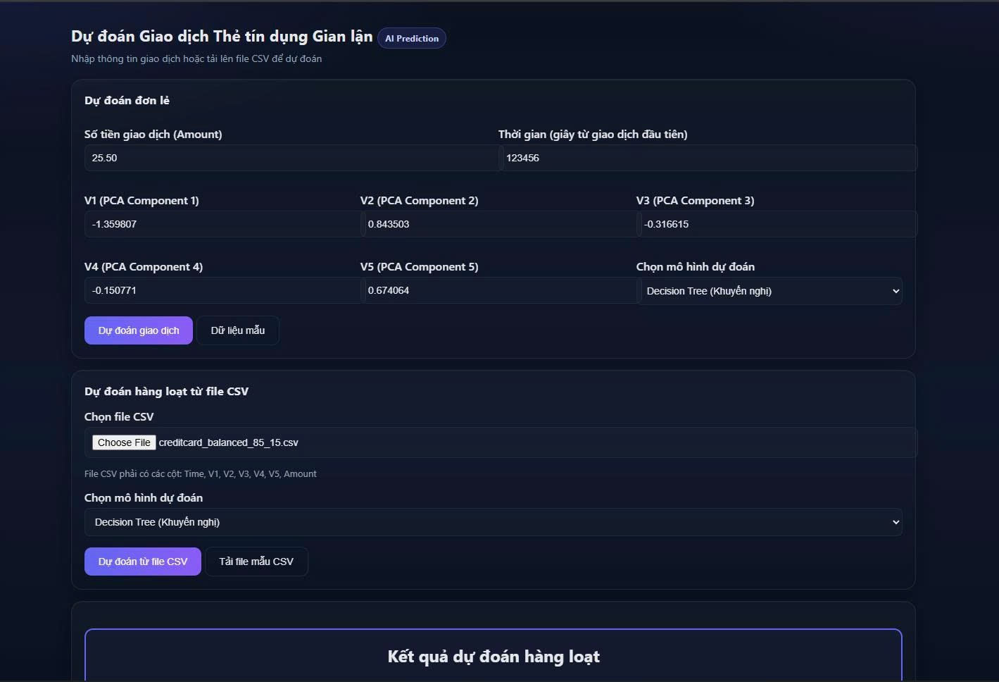
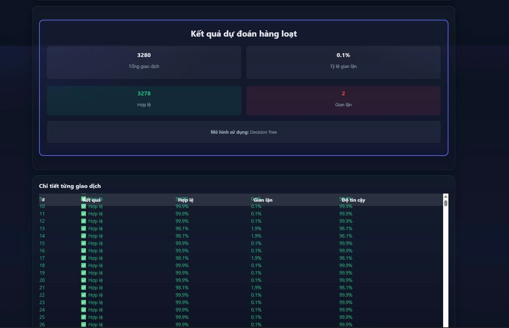

#  Phát hiện gian lận thẻ tín dụng bằng Machine Learning

## 📖 Giới thiệu
Đây là bài tập lớn môn **Nhập môn học máy** với mục tiêu xây dựng hệ thống phát hiện giao dịch gian lận thẻ tín dụng.  
Nhóm đã áp dụng các thuật toán học máy trên bộ dữ liệu **Credit Card Fraud Detection** và triển khai thử nghiệm bằng website demo.
## Giao diện ứng dụng

  
     

  
     

## 📊 Bộ dữ liệu
- Bộ dữ liệu gốc: [Credit Card Fraud Detection - Kaggle](https://www.kaggle.com/mlg-ulb/creditcardfraud)  
- Dữ liệu gồmđã được sửa lại còn:
  - 5000 giao dịch, trong đó có 750 giao dịch gian lận (tỷ lệ 15%).  
  - Các biến `V1..V5` đã được PCA ẩn danh.  
  - Biến `Amount`, `Time` và nhãn `Class` (0 = hợp lệ, 1 = gian lận).  

Trong báo cáo này, nhóm sử dụng **tập dữ liệu đã cân bằng (85% train – 15% test)** để huấn luyện và đánh giá.

## ⚙️ Pipeline giải pháp
1. **Tiền xử lý dữ liệu**  
   - Loại bỏ cột không cần thiết.  
   - Biến đổi `Amount` (log-scale), trích xuất `hour` từ `Time`.  
   - Chuẩn hóa dữ liệu.  
   - Cân bằng lớp bằng **SMOTE**.  

2. **Trích xuất đặc trưng**  
   - **Luồng A**: đặc trưng thủ công (Amount_log, hour, V1..Vn).  
   - **Luồng B**: đặc trưng ẩn từ **Autoencoder**.  

3. **Huấn luyện mô hình**  
   - Naïve Bayes  
   - KNN (k=5)  
   - Decision Tree  

4. **Đánh giá mô hình**  
   - Sử dụng Accuracy, Precision, Recall, F1-score, ROC-AUC.  
   - Vẽ **Confusion Matrix, ROC Curve, PR Curve, Biểu đồ cột so sánh**.  

5. **Triển khai ứng dụng web**  
   - Framework: **Flask**  
   - Cho phép tải file `.csv` và dự đoán giao dịch hợp lệ/gian lận.  

## 📈 Kết quả
| Mô hình           | Accuracy | Precision | Recall | F1-score | ROC-AUC |
|-------------------|----------|-----------|--------|----------|---------|
| Naïve Bayes       | 93.3%    | 83.7%     | 68.8%  | 75.5%    | 0.95    |
| KNN (k=5)         | 88.4%    | 96.3%     | 23.2%  | 37.4%    | 0.77    |
| Decision Tree     | 97.3%    | 95.1%     | 86.6%  | 90.7%    | 0.95    |
| Autoencoder + DT  | 96.5%    | 94.0%     | 84.0%  | 88.7%    | 0.94    |

➡️ **Decision Tree** cho kết quả tốt nhất, cân bằng Precision và Recall.

git clone https://github.com/nhuongg/Phat-hien-giao-dich-the-tin-dung-gian-lan.git
